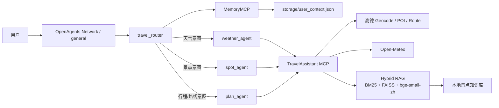
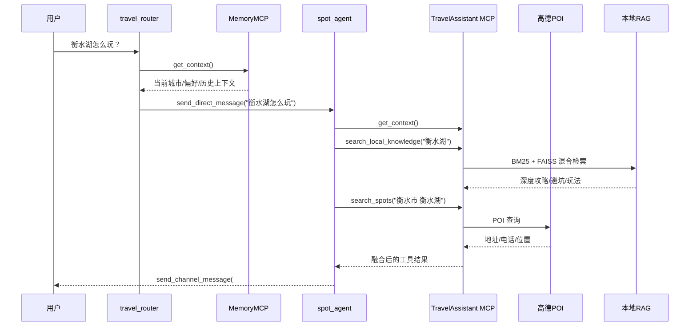

# MCP 总览与 PPT 汇报稿

适用对象：

- 项目答辩
- PPT 制作
- 代码阅读前的总览理解

更新时间：2026-03-19

---

## 1. 一句话总结

这个项目的 MCP 不是一个孤立的接口层，而是整个多智能体旅游助手的统一工具总线：

- `travel_router` 负责接待、读记忆、做意图识别和指代消解
- `weather_agent / spot_agent / plan_agent` 负责垂直任务处理
- 各专业 Agent 通过 MCP 调用真实能力，包括天气、POI、RAG、路线和记忆

从工程角度看，这个项目已经不是原版 OpenAgents 的“Prompt + 广播抢答”示例，而是一个带有 MCP、Hybrid RAG、上下文记忆、路由隔离和 fallback 机制的可运行原型。

---

## 2. 先讲结论：这个项目里 MCP 到底是什么

当前项目里实际有两类 MCP 服务：

| MCP 服务 | 作用 | 主要使用者 |
| --- | --- | --- |
| `TravelAssistant` | 统一暴露天气、景点、RAG、路线、记忆工具 | `weather_agent`、`spot_agent`、`plan_agent` |
| `MemoryMCP` | 只暴露上下文记忆读写 | `travel_router` |

这样拆分的目的很明确：

- 让 `travel_router` 只拥有“读写记忆”和“消息分发”的能力
- 避免 router 直接调用天气、景点、路线等业务工具
- 让专业 Agent 保持“各司其职”

这也是当前项目和原版 OpenAgents 示例最大的结构差异之一。

---

## 3. 当前真实运行架构

需要特别说明：

- 当前真实运行方式不是旧 README 里写的“所有 Agent 在公共频道广播监听、靠关键词抢答”
- 当前真实运行方式是 `travel_router` 串行分发
- 子 Agent 只处理 `direct message`

可以把它理解成一个“路由器 + 专家执行器 + MCP 工具层”的结构。

---

## 4. 两个 MCP 服务分别暴露什么

### 4.1 TravelAssistant MCP

`TravelAssistant` 在 `mcp_server.py` 中通过 FastMCP 注册，当前实际暴露 7 个工具：

| 工具名 | 用途 | 后端能力来源 |
| --- | --- | --- |
| `get_weather` | 查询指定城市实时天气 | 高德地理编码 + Open-Meteo |
| `search_spots` | 查某城市/区县/景点的 POI 信息 | 高德 POI API |
| `search_local_knowledge` | 查本地深度景点知识 | Hybrid RAG |
| `search_combined` | 同时给深度攻略和实时 POI | RAG + 高德 POI |
| `get_driving_route` | 查询两地驾车路线、距离、耗时 | 高德路径规划 |
| `save_context` | 保存对话上下文 | 本地 JSON 记忆 |
| `get_context` | 读取对话上下文 | 本地 JSON 记忆 |

这里有一个很适合答辩时讲的点：

- MCP 不是“封装一个天气接口”
- MCP 在这里承担的是“统一工具协议”的角色
- 让不同 Agent 用同一套调用方式接入不同后端

### 4.2 MemoryMCP

`MemoryMCP` 非常轻，只做两件事：

| 工具名 | 用途 |
| --- | --- |
| `save_context` | 增量更新用户上下文 |
| `get_context` | 读取当前对话中的关键实体信息 |

这相当于给 router 单独开了一个“最小权限”的 MCP。

---

## 5. MCP 背后接的真实能力层

MCP 本身只是统一暴露工具，真正的业务能力来自 `tools/` 目录。

### 5.1 天气工具

天气能力不是写死在 Prompt 里的，而是动态查询：

- 先用高德地理编码把中文地名转成经纬度
- 再调用 Open-Meteo 获取实时天气
- 再由模型组织成自然语言回复

这意味着它支持全国城市、区县甚至更细粒度地名，而不是只支持一小撮硬编码城市。

### 5.2 景点工具

景点能力分成两层：

- `search_spots` 提供实时、权威、偏定位信息的 POI 结果
- `search_local_knowledge` 提供深度攻略、避坑、玩法、美食等“私域内容”

两者组合起来，就是这个项目里常说的：

**高德给广度，RAG 给深度。**

### 5.3 路线工具

路线查询通过高德路径规划拿真实距离、耗时和主干道路，不再是大模型凭常识估计。

### 5.4 记忆工具

记忆落盘到 `storage/user_context.json`，并且是增量更新：

- 本轮提到了城市，就更新 `current_city`
- 提到了景点，就更新 `current_spot`
- 提到了出行人群、偏好、预算、天数，也都能保存

所以系统支持多轮对话中的指代消解，例如：

- “那里天气怎么样”
- “从那里到德州要多久”

---

## 6. 景点场景里的 MCP 调用链

景点问题最能体现这个项目的 MCP 价值，因为它同时串起了：

- 记忆
- Agent 路由
- 高德 POI
- 本地 RAG

这个流程非常适合放在 PPT 里，因为它能同时说明：

- 为什么要多 Agent
- 为什么要 MCP
- 为什么要 RAG
- 为什么要做上下文记忆

---

## 7. 一个很值得讲的实现细节：MCP 是按 Agent 以 stdio 方式挂载的

从当前 YAML 配置可以推断：

- `travel_router` 挂的是 `memory_mcp.py`
- `weather_agent / spot_agent / plan_agent` 挂的是 `mcp_server.py`
- 这些 MCP 都是通过 `type: stdio` 启动的

这说明当前实现更接近：

- 每个 Agent 自己拉起一个 MCP 子进程

而不是：

- 单独部署一个所有 Agent 共享的远程 MCP 网关

这点在做系统图时可以有两种画法：

### 概念图画法

把 MCP 画成统一工具层，便于说明系统思路。

### 实现图画法

把每个 Agent 与自己的 stdio MCP 子进程相连，便于说明真实运行方式。

答辩里一般建议：

- 主图用概念图，清晰
- 口头补一句“当前工程实现是 stdio 挂载，不是独立网关”

---

## 8. 这个项目为什么不只是“接了 MCP”这么简单

如果只说“我把工具封装成 MCP 了”，其实还不够。

这个项目更值得讲的是，围绕 MCP 做了完整的工程化增强：

### 8.1 路由隔离

- `travel_router` 只负责接待、读记忆、分发
- 专家 Agent 只处理 direct message
- 避免多 Agent 抢答、互相触发和近似死循环

### 8.2 Prompt 约束

- router 不能自己处理天气/景点/路线
- 专家 Agent 不能跨域乱答
- 要求每一步必须通过工具行动

### 8.3 Fallback Runner

项目里专门写了：

- `TravelRouterAgent`
- `WeatherFallbackAgent`
- `SpotFallbackAgent`
- `PlanFallbackAgent`

这些 runner 的作用是：

- 禁掉一些不合适的默认行为
- 在模型调用了业务工具、但忘记发频道消息时，自动补发结果

这说明项目不只是“功能能跑”，而是对实际运行中的失效点做过修复。

---

## 9. 做 PPT 时建议强调的 4 个亮点

### 亮点 1：从 Prompt 示例升级成工具驱动系统

原版项目更像“Prompt 演示”。

现在这个本地项目已经升级成：

- Router + 专家 Agent
- MCP 工具层
- 本地记忆
- RAG
- 外部 API

### 亮点 2：Hybrid RAG 真正参与回答

不是把文本塞进向量库就结束，而是：

- 本地知识库内部做 Hybrid 检索
- 系统外部再和高德 POI 结合

所以这里的 “Hybrid” 是双层含义。

### 亮点 3：上下文记忆让多轮对话成立

没有记忆，用户问：

- “那里天气怎么样”
- “从那里到德州多久”

系统就很难理解。

记忆 MCP 的价值就是把多轮对话中的实体延续下来。

### 亮点 4：MCP 让能力可标准化复用

MCP 的真正意义不是只给这个项目自己用，而是：

- 以后换 Agent，调用方式不变
- 以后换客户端，协议不变
- 以后扩工具，接入方式也一致

---

## 10. 可以直接放进答辩 PPT 的话术

下面这段可以直接改一改就上 PPT：

> 本项目基于 OpenAgents 构建了一个多智能体旅游助手系统。在架构上，我没有继续沿用原版的广播式关键词抢答，而是改成了以 `travel_router` 为中心的串行路由模式。
> `travel_router` 负责读取上下文记忆、做意图识别和指代消解，再把任务通过 direct message 分发给天气、景点和行程三个专家 Agent。
> 在能力接入上，我用 MCP 把天气、POI、RAG、路线和记忆统一封装成标准工具接口。这样每个 Agent 都可以通过一致的方式调用真实能力，而不是依赖 Prompt 编造结果。
> 其中天气能力基于高德地理编码和 Open-Meteo，景点能力结合了高德 POI 和本地 Hybrid RAG，路线能力来自高德路径规划，记忆能力则落盘到本地 JSON。
> 因此，这个项目的核心价值不只是“用了 MCP”，而是基于 MCP 做出了一个可路由、可记忆、可检索、可扩展的多智能体原型系统。

---

## 11. 做 PPT 时要避免讲错的地方

这几个点建议统一口径：

- 不要再把系统讲成“4 个 Agent 都在公共频道监听并抢答”
- 不要把天气后端讲成旧版本里出现过的 OpenWeatherMap
- 不要把 MCP 讲成一个单独手工启动的中心服务
- 不要把景点能力讲成“只有 RAG”，因为实际还有高德 POI

更准确的说法是：

- 当前真实架构是 router 串行分发
- 天气是高德地理编码 + Open-Meteo
- 景点是高德 POI + Hybrid RAG
- MCP 当前以 stdio 方式挂到各 Agent 上

---

## 12. 建议的 PPT 结构

如果你准备做 4 页左右，推荐这样排：

### 第 1 页：系统目标与总体架构

- 旅游问答为什么需要多 Agent
- 为什么要引入 MCP
- 放“总体架构图”

### 第 2 页：MCP 工具层设计

- 两个 MCP 服务分别负责什么
- 每个工具背后连接什么真实能力
- 强调标准化、可扩展、可复用

### 第 3 页：一次真实调用链

- 放景点场景的时序图
- 解释 router、memory、RAG、POI 如何协同

### 第 4 页：项目亮点与工程化增强

- 路由隔离
- 记忆支持
- Hybrid RAG
- fallback runner

---

## 13. 相关代码位置

如果之后还要继续补充这份文档，优先看这些文件：

- `mcp_server.py`
- `memory_mcp.py`
- `agents/travel_router.yaml`
- `agents/weather_agent.yaml`
- `agents/spot_agent.yaml`
- `agents/plan_agent.yaml`
- `tools/weather_tools.py`
- `tools/spot_tools.py`
- `tools/memory_tools.py`
- `travel_router_runner.py`
- `weather_agent_runner.py`
- `spot_agent_runner.py`
- `plan_agent_runner.py`
- `README_相对原版改造说明.md`
- `docs/2026-03-15_event_routing_fix.md`

---

## 14. 最后一句话

如果要用一句最短的话来介绍这个项目的 MCP，可以这样说：

**MCP 在这个项目里承担的是多智能体系统的统一工具协议层，把天气、景点、RAG、路线和记忆能力标准化暴露给不同 Agent，使整个旅游助手从 Prompt 演示升级成了可运行的工程化原型。**
