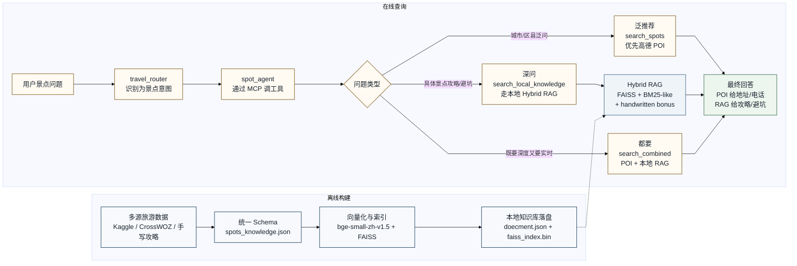
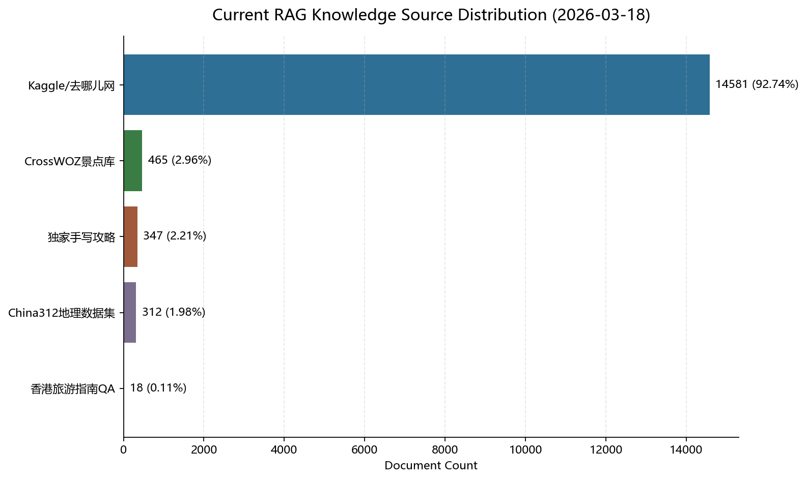

# RAG 全量工作总览

截至 2026-03-18。

这份文档的目标不是重复零散记录，而是把你这个项目里和 RAG 相关的工作统一收口成一份“总账”。读完它，应该能一次回忆起：

- 你为什么要做这套 RAG
- 这套 RAG 是怎么接进 OpenAgents 的
- 数据库是怎么一步步扩起来的
- 检索排序到底怎么算
- 评测体系是怎么搭起来的
- 这套系统当前最强的地方和最真实的技术债分别是什么

## 1. 这套 RAG 一句话是什么

你的项目不是“把文本塞进向量库”那么简单，而是一个面向旅游场景的 Hybrid RAG：

| 层级 | 作用 | 当前实现 |
| --- | --- | --- |
| 系统层 Hybrid | 用不同信息源解决不同类型的问题 | 本地 RAG + 高德 POI API |
| 本地检索层 Hybrid | 在本地知识库内部做混合召回与排序 | FAISS dense + BM25-like lexical + 手写攻略 bonus |
| Agent 层工作流 | 控制什么时候该走 RAG、什么时候不该走 | `travel_router` 分发，`spot_agent` 按问题类型决定 `search_spots` / `search_local_knowledge` / `search_combined` |

所以你这个项目里“Hybrid RAG”有两层含义：

1. 本地知识库内部不是单路检索，而是混合排序。
2. 系统外部不是只信本地知识库，还会结合高德的实时 POI 数据。

## 2. 回忆清单：你到底做了哪些 RAG 工作

这一节可以直接当复盘提纲看。

| 模块 | 你做过的事 | 核心产物 |
| --- | --- | --- |
| 知识库建设 | 把旅游景点数据从零整理成统一 schema | `data/spots_knowledge.json` |
| 私域内容补充 | 把独家手写攻略并入主库，并做来源标记 | `data/new_guides.json`、`tools/merge_new_guides.py` |
| 公域数据扩库 | 接入 Kaggle、China312、CrossWOZ、香港旅游 QA | `tools/convert_csv_to_json.py`、`tools/import_additional_rag_sources.py` |
| 向量化与索引 | 用 `bge-small-zh-v1.5` + FAISS 构建本地可跑的 CPU 向量检索 | `tools/build_spot_vectors.py`、`storage/faiss_index.bin` |
| 混合排序 | 设计 `dense + lexical + handwritten bonus` 的融合打分 | `tools/spot_tools.py` |
| MCP 集成 | 把本地 RAG 暴露成可被 Agent 调用的工具 | `mcp_server.py` |
| Agent 触发策略 | 区分城市级泛推荐和具体景点深问，避免一切问题都先卡在 RAG | `agents/spot_agent.yaml`、`docs/2026-03-15_spot_agent_poi_first_strategy_fix.md` |
| 评测基建 | 把 RAG 从“主观觉得能用”升级成“有 benchmark、有图、有结果文件” | `tools/eval_rag.py`、`tools/generate_eval_dataset.py`、`reports/rag_eval_*` |
| 审计与反思 | 识别出数据分布失衡、BM25-like 不标准、单索引混源等问题 | `docs/2026-03-15_rag审计、评测与改进方案.md` |

## 3. 演进脉络

| 阶段 | 关键工作 | 代表文件 | 结果 |
| --- | --- | --- | --- |
| 第一阶段：把景点知识从 prompt 里拿出来 | 把 Kaggle 城市景点 CSV 转成结构化 JSON，并保留最早一批手写私域攻略 | `tools/convert_csv_to_json.py` | 初版全国化景点知识库形成 |
| 第二阶段：让本地 RAG 真能跑起来 | 用本地 `bge-small-zh-v1.5` 生成向量，用 FAISS 建索引，摆脱对远程 embedding 的依赖 | `tools/build_spot_vectors.py`、`docs/lora_rag_work_summary_2026-03-12.md` | 本地 CPU 可运行的向量检索链路成型 |
| 第三阶段：把“能检索”升级成“能评测” | 新增扩展评测集、Hit@K / MRR、分类统计、Markdown + PNG 报告 | `tools/eval_rag.py`、`tools/generate_eval_dataset.py`、`docs/cursor_note.md` | RAG 有了 benchmark 和图文报告 |
| 第四阶段：审计与结构化反思 | 分析为什么 Hit@1 不高、为什么手写攻略强、公域精确景点弱 | `docs/2026-03-15_rag审计、评测与改进方案.md` | 形成了对优势、问题和下一步的清晰判断 |
| 第五阶段：继续扩数据源 | 接入 CrossWOZ 和香港旅游问答数据，补充北京/香港等场景 | `tools/import_additional_rag_sources.py`、`docs/2026-03-15_rag_dataset_ingest_crosswoz_hk.md` | 知识库从 15240 条扩到 15723 条 |
| 第六阶段：把触发策略调顺 | 城市级泛问法默认走 POI-first，深度玩法问题再补本地 RAG | `docs/2026-03-15_spot_agent_poi_first_strategy_fix.md` | 解决了“什么都先跑 RAG 导致慢或卡”的体验问题 |

## 4. 当前系统里，RAG 是怎么接进去的

### 4.1 工具入口

`spot_agent` 相关的三个核心工具是：

| 工具 | 作用 | 适合的问题 |
| --- | --- | --- |
| `search_spots` | 只查高德 POI | “如皋市有什么好玩的”“故城县景点推荐” |
| `search_local_knowledge` | 只查本地 RAG | “衡水湖怎么玩”“水绘园避坑”“哪里适合拍照” |
| `search_combined` | 先本地 RAG，再拼接高德 POI | 既要深度攻略，又要地址/电话/实时景点候选 |

### 4.2 当前推荐工作流

下面这张图改成了更适合放 PPT 的 Mermaid 简版：

- 左边只讲离线建库
- 右边只讲在线查询
- 具体的 `FAISS + BM25-like + handwritten bonus` 细节收进节点里，不再把图画得过碎



如果 GitHub 上 Mermaid 仍显示不完整，可以直接查看 [PNG 版图示](assets/rag_ppt_figure.png)。

这意味着你现在已经不是“景点问题一律先跑 RAG”，而是有了更成熟的调用策略：

- 城市级泛推荐优先拿 POI，保证速度和覆盖。
- 具体景点深问优先拿本地 RAG，体现私域价值。
- 真正需要两种信息时，再走 `search_combined`。

## 5. 当前知识库长什么样

### 5.1 统一 schema

你的公域和私域数据最后都被整理成同一套结构：

```json
{
  "id": "...",
  "city": "...",
  "district": "...",
  "spot_name": "...",
  "content": "...",
  "tags": ["..."],
  "duration": "...",
  "budget": "...",
  "rating": 4.0,
  "source": "..."
}
```

这一步非常重要，因为后面的 BM25-like 词法打分、向量拼接文本、评测标签、来源分析，全都依赖这个统一 schema。

### 5.2 当前运行库来源分布

当前实际运行的主库是 `storage/doecment.json`，共有 `15723` 条。来源分布如下：

| 来源 | 条数 | 占比 | 角色定位 |
| --- | ---: | ---: | --- |
| `Kaggle/去哪儿网` | 14581 | 92.74% | 主体公域景点覆盖，负责全国广覆盖 |
| `CrossWOZ景点库` | 465 | 2.96% | 补充结构化景点元数据，适合地址、周边信息 |
| `独家手写攻略` | 347 | 2.21% | 私域高价值深度内容，负责避坑、玩法、机位、美食 |
| `China312地理数据集` | 312 | 1.98% | 地理点位和空间补充，偏 POI / 地理背景 |
| `香港旅游指南QA` | 18 | 0.11% | 问答式香港旅游表达补充 |



### 5.3 各来源的真实价值

| 来源 | 优势 | 局限 |
| --- | --- | --- |
| `独家手写攻略` | 最像真正的“私域攻略”，是你项目最能体现差异化的资产 | 条数少，覆盖范围有限 |
| `Kaggle/去哪儿网` | 覆盖广，全国景点多 | 偏百科/宣传介绍，玩法深度有限 |
| `CrossWOZ景点库` | 字段完整，周边信息和票务信息较好 | 不是为你当前排序逻辑量身设计，容易被手写攻略压住 |
| `China312地理数据集` | 地理补点能力强 | 更像 POI / 地理实体，不像高质量攻略文本 |
| `香港旅游指南QA` | 补了问答式表达和香港场景 | 量非常小，目前更多是补充而不是主力 |

## 6. 向量化与索引这块，你做了什么

### 6.1 向量化文本怎么拼

你没有只拿 `content` 去做 embedding，而是把多个关键字段拼在一起：

```text
city + district + spot_name + tags + content
```

这样做的好处是，向量空间里不只保留“正文语义”，还把城市、区县、景点名和标签这些检索强信号一起带进去了。

### 6.2 当前向量栈

| 组件 | 当前实现 |
| --- | --- |
| Embedding 模型 | `BAAI/bge-small-zh-v1.5` |
| 向量维度 | 512 |
| 索引类型 | `faiss.IndexFlatIP` |
| 相似度 | 归一化后内积，等价于余弦相似度 |
| 运行方式 | 本地 CPU 可跑 |

### 6.3 为什么这一步重要

这一步解决了你项目里一个关键工程问题：

- 不再依赖外部 embedding API
- 不需要同时跑一个生成模型和一个重型 embedding 服务
- 让本地版 OpenAgents 的 RAG 真正可运行、可重建、可复现

## 7. 当前本地 RAG 的检索排序到底怎么算

### 7.1 真实公式

本地 RAG 当前不是标准 BM25 + rerank 管线，而是下面这个混合打分：

```text
final_score = 5 * dense_score + bm25_like_score + handwritten_bonus
```

其中：

- `dense_score`：FAISS 召回出的向量相似度，只对 `top-5` 候选生效
- `bm25_like_score`：手写启发式词法打分，不是标准 BM25
- `handwritten_bonus`：只有 `source == 独家手写攻略` 且有词法碰撞时才会触发，当前是 `+50`

### 7.2 BM25-like 词法打分细则

| 信号 | 分值 |
| --- | ---: |
| 城市命中 | `+5` |
| 区县命中 | `+5` |
| 景点名直接命中 | `+15` |
| 景点名部分命中 | `+8` |
| 每个 tag 命中 | `+2` |
| 内容字符覆盖 | `0 ~ 2` |

### 7.3 当前排序特征

这套排序的真实特点是：

- `独家手写攻略 bonus` 非常强。
- 关键词命中对排名的影响通常比向量分更大。
- 向量路负责补语义召回，但不是最终主导因素。
- 目前没有真正的二阶段 rerank。

### 7.4 这套设计的优点

- 工程实现简单，易解释。
- 对私域攻略命中很强。
- 在没有复杂中文分词和倒排索引基础设施时，能快速跑起来。

### 7.5 这套设计的代价

- 容易对 `独家手写攻略` 形成过强偏置。
- 对“精确景点实体检索”不够稳定。
- 不同质量的数据都被混在一个总索引里，缺少分层。

## 8. 评测体系这块，你做了什么

### 8.1 从“能跑”到“能评”

你不是只看聊天效果，而是单独把 RAG 抽出来做了离线 benchmark。核心工作包括：

| 工作 | 产物 |
| --- | --- |
| 扩展评测集生成 | `tools/generate_eval_dataset.py`、`tools/expanded_test_cases.json` |
| 检索评测主脚本 | `tools/eval_rag.py` |
| 图文报告输出 | `reports/rag_eval_20260313_153914/report.md` |
| 机器可读结果 | `reports/rag_eval_20260313_153914/results.json` |

### 8.2 评测指标

当前评测已经不是“看看命中了没”，而是有完整指标：

- `Hit@1 / Hit@3 / Hit@5`
- `MRR`
- 分类统计
- 典型 miss 样例
- 严格 Doc-ID 和宽松实体级两套口径

### 8.3 最新可复核报告快照

注意：下面这组图和指标来自 `2026-03-13` 的最新现成报告，评测时知识库还是 `15240` 条，尚未包含后续新增的 `CrossWOZ景点库` 与 `香港旅游指南QA`。

| 口径 | Hit@1 | Hit@3 | Hit@5 | MRR |
| --- | ---: | ---: | ---: | ---: |
| 严格 Doc-ID | 35.9% | 36.9% | 36.9% | 0.3636 |
| 宽松实体级 | 42.9% | 43.9% | 43.9% | 0.4343 |


### 8.4 分类上最能说明问题的结果

| 分类 | 最关键结论 |
| --- | --- |
| 手写私域攻略 | 很强，`Hit@1 = 91.7%`，证明私域内容价值真实存在 |
| 城市级多答案 | 宽松口径很高，说明城市级泛问法对系统整体是友好的 |
| Kaggle 基线 | 严格口径很弱，说明同实体多来源和精确文档匹配是问题 |
| 精确景点 | `Hit@1 = 23.8%`，暴露出实体精确召回和排序都还不稳 |
| 城市+景点 | 中等偏弱，说明混合查询下的实体约束还不够强 |


### 8.5 评测带来的最重要洞察

这套 benchmark 让你看清了三件事：

1. 你的 RAG 不是“完全没用”，因为手写攻略表现已经很强。
2. 当前瓶颈不是只有排序，很多 case 是前 5 都没召回到理想候选。
3. 同一个景点的跨来源重复条目，会显著影响严格 Doc-ID 结果解释。

## 9. 这套 RAG 的真实价值

如果只靠高德 API，你拿到的是：

- 地址
- 电话
- 行政区划
- 实时景点候选

如果只靠 LLM 记忆，你容易遇到：

- 幻觉
- 细节瞎编
- 缺少本地化避坑和私域经验

你这套 RAG 真正补上的，是高德和大模型都不擅长的部分：

- 玩法建议
- 避坑提示
- 拍照机位
- 本地美食
- 路线建议
- 私域经验

所以这套 RAG 的核心意义不是“替代 API”，而是：

> 用本地私域知识把公域 POI 和大模型回答接地气、去幻觉、拉开差异化。

## 10. 当前最真实的技术债

这部分必须诚实，因为它也是你工作的一部分。

| 问题 | 当前现象 | 影响 |
| --- | --- | --- |
| BM25-like 不是标准 BM25 | 当前 `_bm25_score()` 是启发式打分 | 精确实体检索能力有限，可解释性一般 |
| 所有来源混在一个主索引里 | POI 元数据、私域攻略、问答语料没有分层 | 不同质量数据相互干扰 |
| `独家手写攻略` bonus 偏重 | 只要有词法碰撞就很容易长期压过公域条目 | 公域景点精确排序被扰动 |
| 还没有真正 rerank | 当前只有一次混合排序，没有二阶段精排 | 前 5 候选质量不够时难补救 |
| 城市级问题曾经默认先跑 RAG | 后来才修成 POI-first | 说明触发策略需要和检索质量一起设计 |
| 评测脚本存在接口漂移 | `eval_rag.py` 里 import `retrieve_knowledge()`，但当前 `spot_tools.py` 已无该函数 | 评测链路当前需要修一次才能重新跑通 |
| 文档存在历史漂移 | 部分文档仍写 `15240` 条、`+35 bonus`、旧入口说明 | 不利于统一口径 |

## 11. 关键文件索引

| 文件 | 作用 |
| --- | --- |
| `tools/spot_tools.py` | 本地 RAG 主检索逻辑，含 FAISS + BM25-like + source bonus |
| `tools/build_spot_vectors.py` | 读取知识库、生成 embedding、构建 FAISS 索引 |
| `tools/convert_csv_to_json.py` | 把 Kaggle 城市景点 CSV 转成主知识库 JSON |
| `tools/merge_new_guides.py` | 合并私域手写攻略 |
| `tools/import_additional_rag_sources.py` | 接入 CrossWOZ 和香港旅游 QA |
| `mcp_server.py` | 把 `search_local_knowledge` / `search_combined` 暴露给 Agent |
| `agents/spot_agent.yaml` | 景点 Agent 的工具调用策略 |
| `tools/generate_eval_dataset.py` | 生成扩展 RAG 评测集 |
| `tools/eval_rag.py` | 计算 Hit@K / MRR，输出报告和图表 |
| `reports/rag_eval_20260313_153914/` | 最新可复核的现成 RAG 评测报告快照 |
| `docs/2026-03-15_rag审计、评测与改进方案.md` | RAG 审计、问题分析、后续建议 |
| `docs/2026-03-15_rag_dataset_ingest_crosswoz_hk.md` | 新来源接入记录 |
| `docs/2026-03-15_spot_agent_poi_first_strategy_fix.md` | 城市级景点 POI-first 策略修复 |

## 12. 30 秒复述版

如果以后你只想快速回忆，可以直接背这一段：

1. 我先把旅游景点数据整理成统一 schema，做成了本地结构化知识库。
2. 我把私域手写攻略、公域 Kaggle 数据、China312、CrossWOZ 和香港旅游 QA 合并进了同一套主库。
3. 我用 `bge-small-zh-v1.5` + FAISS 在本地做了可 CPU 跑的向量检索。
4. 我在排序上做了 `dense + BM25-like + handwritten bonus` 的混合检索，而不是单纯向量库。
5. 我把这套 RAG 通过 MCP 暴露给 `spot_agent`，并和高德 POI 做了工作流级融合。
6. 我又补了一套 RAG benchmark，用 `Hit@K`、`MRR`、分类统计和图表去看它到底哪里强、哪里弱。
7. 结果证明：私域手写攻略这层很强，但精确景点实体召回、公域排序和多源分层仍然是技术债。
8. 所以我现在能清楚地讲这套 RAG 的价值、现状、问题和下一步，而不是只说“我做了个向量库”。

## 13. 建议如何继续维护这份总账

以后每次 RAG 有大改动，优先更新这几个位置：

1. 当前知识库总量和来源分布
2. 排序公式和 bonus 参数
3. 最新可复核评测报告路径
4. 当前已知技术债
5. 新增数据源或新策略的变更记录

这样这份文档就能一直作为你的 RAG 单点入口，而不是再回到“信息散落在五六个文件里”的状态。
