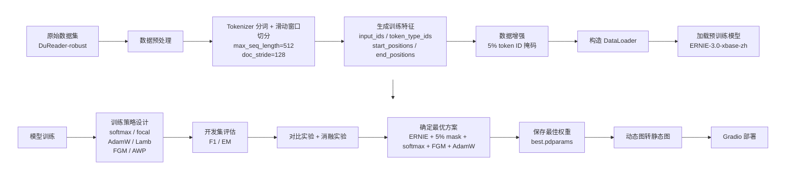
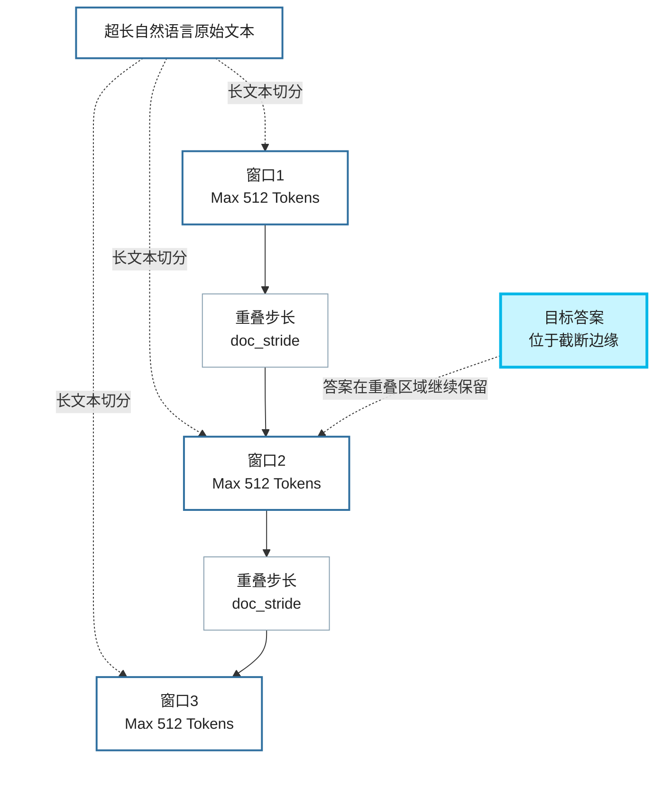
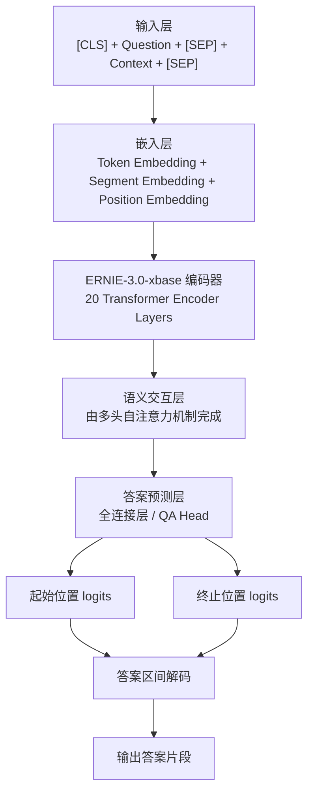

# 基于深度学习的机器阅读理解模型研究 - 新PPT内容草案

> 适用对象：本科毕设答辩/汇报型 PPT  
> 内容来源：项目代码、论文《基于深度学习的机器阅读理解模型研究》、答辩 PPT  
> 核心结论：最终最优方案为 `ERNIE-3.0-xbase-zh + 5% token ID 掩码 + softmax 交叉熵 + FGM + AdamW`

---

## 1. 项目整体介绍

### 1.1 研究背景

机器阅读理解（Machine Reading Comprehension, MRC）是自然语言处理中的经典任务，目标是让模型理解给定文本，并根据问题从文本中抽取出正确答案。相比传统基于规则、CNN 或 RNN 的问答方法，基于 Transformer 的预训练语言模型在上下文建模、长距离依赖捕捉和迁移学习能力方面更强，因此更适合中文阅读理解任务。

本文聚焦**片段抽取式中文机器阅读理解**任务，在 `DuReader-robust` 数据集上进行实验，对多种中文预训练模型进行对比，并结合数据增强、损失函数、优化器与对抗训练策略，最终得到一个效果较好的中文问答模型，并基于 Gradio 实现可视化部署。

### 1.2 任务定义

机器阅读理解任务可表示为：

$$
f(c, q) = a
$$

其中：

- $c$ 表示原文 `context`
- $q$ 表示问题 `question`
- $a$ 表示答案 `answer`

本项目属于**片段抽取式问答**，即答案必须来自原文中的某一连续片段，因此模型需要预测答案的**起始位置**和**终止位置**。

### 1.3 项目目标

- 构建一个基于中文预训练模型的阅读理解系统
- 在 `DuReader-robust` 数据集上完成训练与评估
- 比较不同预训练模型的效果差异
- 验证数据增强、损失函数、对抗训练、优化器等策略的有效性
- 将最优模型进行部署，形成可交互式问答界面

### 1.4 项目最终结论

- 最优预训练模型：`ERNIE-3.0-xbase-zh`
- 最优训练策略：`5% token ID 掩码 + softmax 交叉熵 + FGM + AdamW`
- 最优结果：`F1 = 90.55597`，`EM = 78.61680`

---

## 2. 新PPT建议目录

如果你准备重新做一版答辩 PPT，建议按下面顺序组织：

1. 研究背景与意义
2. 任务定义与问题形式
3. 项目整体方案
4. 数据集与数据处理
5. 预训练模型对比与模型选型
6. 最终模型架构图
7. 训练策略设计
8. 实验环境与超参数
9. 对比实验结果
10. 消融实验结果
11. 最优模型训练曲线/结果分析
12. 模型部署与前端界面展示
13. 项目总结
14. 不足与未来工作

> 如果担心“还缺什么步骤”，通常最容易漏掉的是：**评价指标、模型选型理由、消融实验、部署流程、局限性和展望**。

---

## 3. 项目整体流程图

下面这份 Mermaid 流程图可直接放到 GitHub Markdown 或新 PPT 中。



---

## 4. 数据集与数据处理

### 4.1 数据集说明

本项目使用的是 `DuReader-robust` 单篇章抽取式中文阅读理解数据集。

| 数据划分 | 样本量 | 说明 |
| --- | ---: | --- |
| Train | 14520 | 用于模型训练 |
| Dev | 1417 | 用于模型评估与模型选择 |
| Test | 50000 | 包含鲁棒性测试子集 |

数据字段主要包括：

- `context`：原文
- `question`：问题
- `id`：样本编号
- `answers.text`：答案文本
- `answers.answer_start`：答案在原文中的起始字符位置

### 4.2 数据示例 JSON

```json
{
  "context": "九江古称江州、浔阳、柴桑、汝南、湓城、德化，有江西北门之称。",
  "question": "九江在哪里",
  "answers": {
    "text": ["江西"],
    "answer_start": [158]
  },
  "id": "example_001"
}
```

再给一个更接近项目代码输入格式的推理样例：

```json
[
  {
    "id": "1",
    "question": "220v一安等于多少瓦",
    "context": "在220交流电的状态下一安等于220瓦。"
  },
  {
    "id": "2",
    "question": "氧化铜和稀盐酸的离子方程式",
    "context": "化学方程式：CuO+2HCl=CuCl2+H2O，离子方程式：CuO+2H+=Cu2+ +H2O。"
  }
]
```

### 4.3 文本长度分布

| 类型 | 平均长度 | 最大长度 | 最短长度 |
| --- | ---: | ---: | ---: |
| context | 282 | 1881 | 100 |
| question | 9 | 42 | 2 |

由于很多 `context` 长度超过 512，因此不能直接截断，需要使用**滑动窗口**切分长文本。

### 4.3.1 滑动窗口与重叠步长示意图

下面这版把原图里过长、过乱的说明做了简化：

- 去掉了顶部英文
- 明确把 `doc_stride` 标成“重叠步长”
- 保留“超长原文 + 多窗口 + 答案落在边缘”的核心表达



> 这一版更适合答辩 PPT。如果你想更像原图，我下一步可以再给你一版“窗口位置错开”的 Mermaid 近似版。

### 4.4 数据预处理流程

1. 使用预训练模型对应的 `Tokenizer` 进行分词
2. 设置 `max_seq_length=512`
3. 设置 `doc_stride=128`
4. 对长文本进行滑动窗口切分
5. 构造训练标签 `start_positions` 和 `end_positions`
6. 验证集保留 `example_id` 和 `offset_mapping` 以便回溯答案文本
7. 进行 `5%` 的 token ID 掩码增强
8. 构造 `DataLoader`

### 4.5 预处理后特征说明

| 特征名 | 含义 |
| --- | --- |
| `input_ids` | 输入文本的 token ID 序列 |
| `token_type_ids` | 区分问题与原文，问题为 0，原文为 1 |
| `start_positions` | 答案起始位置 |
| `end_positions` | 答案终止位置 |
| `offset_mapping` | token 与原文字符位置映射 |
| `example_id` | 样本编号 |

### 4.6 数据增强策略

项目中尝试过多种思路，最终有效的是**token ID 掩码策略**。做法是对训练集中的 `input_ids` 按概率随机置零：

```python
p = 0.05
for example in train_dataset:
    for i, input_id in enumerate(example["input_ids"]):
        if random() < p:
            example["input_ids"][i] = 0
```

这种方法本质上类似于弱化版的 MLM 思想，目的是降低模型对局部高频词的依赖，增强鲁棒性。

---

## 5. 最终选用模型与结构分析

### 5.1 最终选用模型

最终选用的模型是：

```text
ernie-3.0-xbase-zh
```

对应代码中实际加载方式为：

```python
model = AutoModelForQuestionAnswering.from_pretrained("ernie-3.0-xbase-zh")
```

### 5.2 是否对模型做了改良？

从**代码实现**来看，项目并**没有额外改写 ERNIE 主干结构**，也没有手写新的 Encoder、交互层或额外注意力模块。  
因此更准确的表述应该是：

> 本项目采用 `ERNIE-3.0-xbase-zh` 作为主干模型，在其问答任务头的基础上进行微调，并在训练策略层面进行了优化，包括数据增强、损失函数设计、优化器选择和对抗训练。

也就是说：

- **模型结构层面**：基本沿用原生 `ERNIE-3.0-xbase-zh + QA Head`
- **训练策略层面**：做了优化和增强

论文中提到的“词向量层、文本编码层、语义交互层、答案预测层”，更像是对 ERNIE 问答模型的**结构性解释与分层描述**，不是单独实现的新模块。

### 5.3 最终模型架构图



### 5.4 架构说明

如果要在答辩时解释这一页，可以这样讲：

- 输入由问题与原文拼接组成，中间使用 `[SEP]` 分隔
- 嵌入层由 `token embedding + segment embedding + position embedding` 组成
- 主干网络为 `20` 层 Transformer 编码器
- 语义交互并不是单独新加的层，而是由 ERNIE 内部的多头自注意力实现
- 最后通过问答头分别预测答案的开始位置和结束位置

嵌入层的表示公式为：

$$
E = E_{token} + E_{segment} + E_{position}
$$

### 5.5 预训练模型对比与选型依据

| 模型 | 权重规模说明 | 训练时间(s) | F1 | EM |
| --- | --- | ---: | ---: | ---: |
| Chinese-ELECTRA-base | 12-layer, 768-hidden, 4-heads, 12M-params | 1753 | 87.03 | 74.10 |
| BERT-wwm-ext-Chinese | 12-layer, 768-hidden, 12-heads, 108M-params | 1770 | 87.03 | 73.67 |
| nezha-base-Chinese | 12-layer, 768-hidden, 12-heads, 108M-params | 2193 | 86.92 | 73.81 |
| ALBERT-Chinese-xxlarge | 12-layer, 4096-hidden, 16-heads, 235M-params | 6438 | 88.51 | 75.42 |
| ERNIE-3.0-xbase-zh | 20-layer, 1024-hidden, 16-heads, 296M-params | 7393 | 90.05 | 77.27 |

结论：

- `Chinese-ELECTRA-base` 训练速度最快，适合作为基线模型
- `ERNIE-3.0-xbase-zh` 指标最好，因此被选为最终模型

---

## 6. 模型训练设计

### 6.1 实验环境

| 项目 | 配置 |
| --- | --- |
| 平台 | 百度 AI Studio |
| CPU | 4 cores |
| GPU | Tesla V100 |
| 内存 | 32 GB |
| 显存 | 32 GB |
| Python | 3.10 |
| 深度学习框架 | paddlepaddle-gpu 2.5.2 |
| PaddleNLP | 2.6.1.post |

### 6.2 超参数设置

| 参数 | 设置 |
| --- | --- |
| learning rate | 3e-5 |
| epoch | 2 |
| batch size | 12 |
| max seq length | 512 |
| doc stride | 128 |
| warmup proportion | 0.1 |
| weight decay | 0.01 |
| log steps | 10 |
| eval steps | 100 |
| total training steps | 2942 |

### 6.3 优化策略组合

| 类别 | 方案 |
| --- | --- |
| 优化器 | AdamW、Lamb |
| 损失函数 | softmax 交叉熵、focal loss |
| 对抗训练 | FGM、AWP |
| 学习率调度 | Linear Decay with Warmup |
| 正则化策略 | 忽略 `layer norm` 与 `bias` 的 weight decay |

### 6.4 训练过程说明

训练过程可以概括为：

1. 取一个 batch 输入模型
2. 预测答案起止位置
3. 计算 loss
4. 反向传播
5. 加入 FGM 或 AWP 对抗扰动再次训练
6. 更新参数
7. 每 `100` step 在验证集上评估一次
8. 保存 F1 最优的模型参数

---

## 7. 损失函数、优化器与对抗训练公式

这一页建议做成“公式 + 一句话解释”的形式，答辩时最清晰。

### 7.1 softmax 交叉熵损失

片段抽取式问答需要分别预测答案起始位置和终止位置，因此最终损失可写为：

$$
L = \frac{L_{start} + L_{end}}{2}
$$

其中单个位置的 softmax 交叉熵可表示为：

$$
L_{ce} = -\log\frac{e^{z_y}}{\sum_{i=1}^{K} e^{z_i}}
$$

说明：

- $z_i$ 是各位置的预测 logit
- $z_y$ 是真实位置对应的 logit
- 该损失适合当前位置分类问题

### 7.2 focal loss

论文中使用的 focal loss 形式为：

$$
L = -y \cdot \alpha (1-\sigma(x))^\gamma \log(\sigma(x))
    -(1-y)\cdot(1-\alpha)\sigma(x)^\gamma \log(1-\sigma(x))
$$

说明：

- $\alpha$ 用于平衡正负样本
- $\gamma$ 用于降低简单样本的权重、强调困难样本
- 在本项目中，focal loss 曲线更平滑，但最终效果不如 softmax 交叉熵

### 7.3 FGM 对抗训练

FGM 在嵌入层上添加扰动：

$$
\Delta x = \epsilon \cdot \frac{\nabla_x L(x,y;\theta)}{\|\nabla_x L(x,y;\theta)\|}
$$

加入扰动后的目标可表示为：

$$
\min_{\theta} \; \mathbb{E}_{(x,y)\sim D} \left[L(x+\Delta x, y; \theta)\right]
$$

说明：

- FGM 直接对 embedding 施加微小扰动
- 目的是增强模型对输入微小变化的鲁棒性
- 本项目中 FGM 是**最有效**的对抗训练方式

### 7.4 AWP 对抗训练

AWP 对模型权重施加扰动：

$$
\Delta \theta = \epsilon \cdot
\frac{\nabla_{\theta}L(x,y;\theta)}{\|\nabla_{\theta}L(x,y;\theta)\|}
\cdot (\|w\| + \tau)
$$

对应目标为：

$$
\min_{\theta} \; \mathbb{E}_{(x,y)\sim D} \left[L(x, y; \theta + \Delta\theta)\right]
$$

说明：

- FGM 扰动输入表示
- AWP 扰动模型参数
- 本项目里 AWP 有效果，但不如 FGM

### 7.5 AdamW 优化器

AdamW 的核心更新思想可写为：

$$
\theta_{t+1}=\theta_t-\eta \cdot \frac{\hat m_t}{\sqrt{\hat v_t}+\epsilon}-\eta\lambda\theta_t
$$

说明：

- 在 Adam 基础上引入解耦权重衰减
- 对 Transformer 微调任务更稳定
- 本项目中 AdamW 优于 Lamb

### 7.6 线性预热与衰减学习率

预热阶段：

$$
lr = lr_{start} \cdot \frac{step}{warmup\_steps}
$$

衰减阶段：

$$
lr = lr_{start}\left(1-\frac{step-warmup\_steps}{total\_steps-warmup\_steps}\right)
$$

说明：

- 前期缓慢升高学习率，避免训练不稳定
- 后期线性衰减，帮助模型平稳收敛

---

## 8. 对比实验与消融实验

### 8.1 基线模型优化策略对比（ELECTRA）

| 序号 | 损失函数 | 数据掩码率 | 对抗训练 | 优化器 | F1 | EM |
| --- | --- | --- | --- | --- | ---: | ---: |
| 1 | softmax | — | — | AdamW | 87.03 | 74.10 |
| 2 | softmax | 0.03 | — | AdamW | 86.17 | 72.75 |
| 3 | softmax | 0.02 | — | AdamW | 86.22 | 73.67 |
| 4 | softmax | 0.1 | — | AdamW | 86.20 | 72.19 |
| 5 | softmax | 0.05 | FGM | AdamW | 87.34 | 74.45 |
| 6 | softmax | — | FGM | Lamb | 81.72 | 67.81 |
| 7 | focal | — | — | AdamW | 84.82 | 71.91 |
| 8 | focal | — | FGM | AdamW | 86.48 | 73.88 |
| 9 | softmax | 0.05 | — | AdamW | 86.34 | 73.25 |
| 10 | softmax | — | AWP | AdamW | 86.56 | 73.67 |
| 11 | softmax | 0.05 | AWP | AdamW | 86.65 | 73.18 |
| 12 | focal | 0.05 | AWP | AdamW | 85.59 | 72.61 |

结论：

- 5% 掩码率优于 2%、3%、10%
- FGM 明显优于 AWP
- softmax 交叉熵优于 focal loss
- AdamW 明显优于 Lamb

### 8.2 ERNIE-3.0-xbase 消融实验

| 方案 | 消融结构 | F1 | EM |
| --- | --- | ---: | ---: |
| ERNIE + softmax + 5%数据掩码 + FGM | — | 90.55 | 78.61 |
| ERNIE + softmax + FGM | 去掉数据掩码 | 90.41 | 78.12 |
| ERNIE + softmax + 5%数据掩码 | 去掉 FGM | 90.10 | 78.04 |
| ERNIE + focal + FGM | 用 focal 替代 softmax | 88.21 | 74.02 |

结论：

- 三个优化点都有效，但贡献程度不同
- 改用 `focal loss` 后性能下降最明显
- 说明 `softmax loss` 对本任务更合适
- `FGM` 和 `5% 数据掩码` 都带来了可观增益

### 8.3 最优模型结论页可直接使用的表述

可直接放在 PPT 总结页：

> 本文最终得到的最优模型为基于 `ERNIE-3.0-xbase-zh` 的中文机器阅读理解模型，采用 `5% token ID 掩码` 数据增强、`softmax 交叉熵损失函数`、`FGM 对抗训练` 和 `AdamW` 优化器，在 `DuReader-robust` 开发集上取得了 `F1=90.55597`、`EM=78.61680` 的结果。

---

## 9. 评价指标

### 9.1 EM

精确匹配度（Exact Match）表示预测答案与标准答案是否完全一致：

$$
EM = \frac{pred}{total}
$$

### 9.2 F1

F1 综合考虑精确率与召回率：

$$
F1 = 2 \cdot \frac{precision \cdot recall}{precision + recall}
$$

其中：

$$
precision = \frac{overlap}{pred}, \qquad recall = \frac{overlap}{gold}
$$

说明：

- `EM` 更严格
- `F1` 更能反映答案片段的局部重合程度
- 片段抽取式阅读理解中通常同时报告 `F1` 和 `EM`

---

## 10. 模型部署与前端界面

### 10.1 部署流程

项目的部署流程为：

1. 使用最优权重 `best.pdparams`
2. 将动态图模型转换为静态图模型
3. 生成 `model.pdmodel`、`model.pdiparams`、`model.pdiparams.info`
4. 编写推理函数 `infer()`
5. 使用 Gradio 封装为交互式 Web 问答界面

### 10.2 部署代码思路

项目中 Gradio 部署的接口形式较简单，本质是：

```python
gr.Interface(
    fn=question_answer,
    inputs=["text", "text"],
    outputs=["text"]
).launch(share=True)
```

### 10.3 前端界面结构

从 PPT 中的界面截图可以总结出前端设计包括：

- `context`：大文本输入框，用于输入原文
- `question`：问题输入框，用于输入针对原文的问题
- `Submit`：提交按钮，触发问答推理
- `Clear`：清空按钮
- `output`：输出框，展示模型抽取出的答案
- `Flag`：Gradio 默认反馈组件

### 10.4 界面展示说明

界面整体属于简洁型 Demo 页面，特点如下：

- 表单结构清晰，符合“原文-问题-答案”的任务逻辑
- 输入输出一一对应，适合答辩演示
- 交互成本低，评委可以直观看到阅读理解过程
- 适合作为模型验证原型，但不属于复杂业务系统前端

### 10.5 可直接放到 PPT 里的界面介绍词

> 前端界面基于 Gradio 构建，包含原文输入框、问题输入框、提交按钮、清空按钮和答案输出框。用户输入一段文本和相应问题后，系统调用训练好的阅读理解模型进行片段抽取，并返回答案，实现了一个可交互式中文问答 Demo。

### 10.6 界面案例

PPT 中展示了两个典型交互案例：

1. 输入关于 iPad Pro 的介绍文本，提问“ipad pro2 的上市时间”，系统输出“3月31日”
2. 输入关于光年的解释文本，提问“1光年等于多少千米”，系统输出“9.5万亿公里”

> 这一页建议左侧放输入截图，右侧放输出截图，最后再补一句“说明模型具备基本的片段抽取式问答能力”。

---

## 11. 项目实现亮点

这一页建议压缩成 3 到 4 点：

1. 基于中文预训练模型完成片段抽取式机器阅读理解任务
2. 对比多种主流中文预训练模型，最终选定 `ERNIE-3.0-xbase-zh`
3. 引入 `5% token ID 掩码 + FGM + softmax + AdamW` 形成有效训练策略
4. 完成模型推理部署与 Gradio 可视化界面展示

---

## 12. 项目不足与未来工作

这一页可以直接参考论文结论部分，建议写成下面这种形式：

### 12.1 当前不足

- 当前任务仍然是片段抽取式问答，必须同时提供问题和原文
- 没有真正修改 ERNIE 主干结构，主要优化集中在训练策略
- 前端界面偏原型化，展示性强但工程化程度有限
- 对抗训练只尝试了 FGM 和 AWP，策略还不够丰富

### 12.2 未来工作

- 继续研究自由回答式机器阅读理解
- 尝试改进语义交互层，让问题与原文融合得更充分
- 复现更新、更强的对抗训练技术
- 尝试更多优化器和更丰富的数据增强方法
- 完善部署端界面与交互体验

---

## 13. 答辩时对“创新点/改进点”的建议表述

如果老师问“你这个模型到底改了什么”，建议不要说成“改了 ERNIE 架构”，而是这样回答更稳妥：

> 本项目没有直接修改 ERNIE-3.0-xbase 的底层网络结构，而是在预训练模型微调框架下，重点研究了训练策略的组合优化，包括 5% token ID 掩码数据增强、softmax 交叉熵损失、FGM 对抗训练和 AdamW 优化器，并通过对比实验和消融实验证明这些策略对中文机器阅读理解任务是有效的。

这个表述和你的代码、论文、PPT 三者是一致的，不容易被追问到结构创新的细节漏洞。

---

## 14. 最后一页总结可直接使用

> 本文围绕中文片段抽取式机器阅读理解任务，基于 `DuReader-robust` 数据集完成了数据处理、模型训练、对比实验、消融实验与推理部署。实验结果表明，`ERNIE-3.0-xbase-zh` 在五种候选预训练模型中表现最佳；结合 `5% token ID 掩码`、`softmax 交叉熵`、`FGM 对抗训练` 与 `AdamW` 优化器后，模型在开发集上取得了 `F1=90.56`、`EM=78.62` 的结果。最终，项目基于 Gradio 构建了可交互式问答界面，验证了模型在中文阅读理解场景中的可用性。
