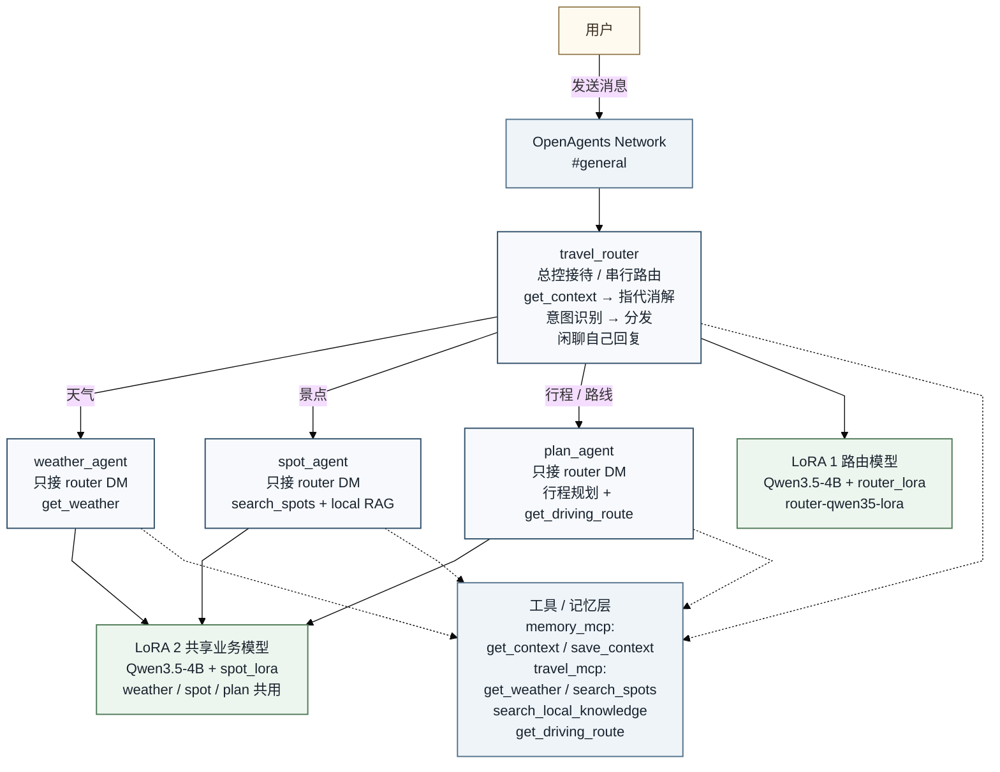

# 多智能体旅游小助手 - 开发文档

## 一、项目概述

### 1.1 项目简介
基于 OpenAgents 框架开发的多智能体旅游助手系统，通过多智能体协作为用户提供智能化旅游服务。

### 1.2 核心功能
- **天气查询**：提供天气信息和穿衣建议
- **景点推荐**：推荐热门景点，介绍攻略
- **行程规划**：智能制定旅游行程安排
- **智能问答**：旅游相关咨询与建议

### 1.3 技术栈
- **框架**：OpenAgents
- **智能体类型**：CollaboratorAgent (YAML 配置)
- **LLM 模型**：Qwen3.5-4B (本地 LM Studio 部署)
- **配置格式**：YAML

---

## 二、系统架构

### 2.1 多智能体协作架构



### 2.2 协作机制

**当前真实运行机制不是“广播抢答”，而是“router 串行分发”。**

| 组件 | 当前触发方式 | 当前模型 / 能力来源 |
|--------|-----------|---------------|
| `travel_router` | 监听公共频道消息与 reply，统一接待、读写记忆、意图分发 | `router-qwen35-lora` |
| `weather_agent` | 只处理 `travel_router` 发来的 direct message | `spot-qwen35-lora` + `get_weather` |
| `spot_agent` | 只处理 `travel_router` 发来的 direct message | `spot-qwen35-lora` + `search_spots` + `search_local_knowledge` |
| `plan_agent` | 只处理 `travel_router` 发来的 direct message | `spot-qwen35-lora` + `get_driving_route` |

补充说明：

- `travel_router` 当前单独挂载 `router_lora`
- `weather_agent / spot_agent / plan_agent` 当前共用 `spot_lora`
- 子 Agent 默认不再监听公共频道关键词，不直接参与广播式抢答

---

## 三、智能体设计

### 3.1 travel_router (接待员智能体)

**文件**：`agents/travel_router.yaml`

**职责**：
- 欢迎用户打招呼
- 介绍团队功能
- 处理一般性旅游咨询

**触发条件**：
- 包含：你好、嗨、hello、能做什么、介绍
- 不包含：天气/景点/推荐/规划 等专业关键词

**示例对话**：
```
用户：你好
travel_router：👋 您好！我是旅游小助手团队，很高兴为您服务！

我们有三位专业助手：
- 🌤️ 天气助手：查询天气、穿衣建议
- 🏛️ 景点助手：推荐景点、介绍攻略
- 🗓️ 行程助手：规划行程、安排路线
```

### 3.2 weather_agent (天气智能体)

**文件**：`agents/weather_agent.yaml`

**职责**：
- 查询实时天气
- 提供天气预报
- 给出穿衣建议

**触发条件**：
- 包含：天气、气温、温度、下雨、下雪、晴、阴、热、冷、穿衣、外套

**示例对话**：
```
用户：北京今天天气怎么样？
weather_agent：🌤️ 北京目前的天气情况：

🌡️ 温度：约3°C
☁️ 天气：多云
💨 风力：≤3级

🧥 穿衣建议：天气寒冷，建议穿羽绒服、棉衣等厚重保暖衣物
```

### 3.3 spot_agent (景点智能体)

**文件**：`agents/spot_agent.yaml`

**职责**：
- 推荐城市热门景点
- 介绍景点特色
- 提供游玩攻略

**触发条件**：
- 包含：景点、推荐、好玩、旅游、逛、玩、去哪、哪里
- 或包含具体景点名：故宫、长城、西湖、兵马俑等

**支持城市**：
北京、上海、杭州、西安、成都、厦门、三亚、丽江

**示例对话**：
```
用户：推荐杭州景点
spot_agent：🏙️ 为您推荐杭州的热门景点：

1. 西湖 ⭐⭐⭐⭐⭐
   📍 浙江省杭州市西湖区
   ℹ️ 世界文化遗产，"人间天堂"之美誉

2. 灵隐寺 ⭐⭐⭐⭐⭐
   📍 杭州市西湖区灵隐路
   ℹ️ 千年古刹，佛教名寺

3. 雷峰塔 ⭐⭐⭐⭐
   📍 西湖南岸
   ℹ️ 西湖十景之一，白娘子传说地
```

### 3.4 plan_agent (行程智能体)

**文件**：`agents/plan_agent.yaml`

**职责**：
- 规划多日游行程
- 安排每日景点
- 提供时间安排建议

**触发条件**：
- 包含：规划、行程、安排、路线、游、日游、怎么玩
- 或包含天数：3天、2天、一日游、两日游、三日游

**规划原则**：
1. 合理性：景点按地理区域分组
2. 劳逸结合：每天3-5个景点
3. 经典优先：优先知名景点
4. 时间考虑：考虑开放时间

**示例对话**：
```
用户：规划北京3天行程
plan_agent：🗺️ 北京3日游行程规划

════════════════════════════════

📅 第1天行程：
🕐 上午 9:00  🏛️ 天安门广场
🕐 上午 10:00 🏛️ 故宫博物院（游览3小时）
🕐 中午 12:00 🍽️ 午餐休息
🕐 下午 14:00 🏛️ 景山公园
🕐 傍晚 17:00 🏛️ 王府井大街

📅 第2天行程：
🕐 上午 9:00  🏛️ 八达岭长城（游览4小时）
🕐 下午 15:00 🏛️ 鸟巢水立方

📅 第3天行程：
🕐 上午 9:00  🏛️ 天坛公园
🕐 下午 14:00 🏛️ 颐和园（游览3小时）

════════════════════════════════

💡 旅行小贴士：
• 建议提前预订门票，避免排队
• 长城建议选择八达岭或慕田峪
```

---

## 四、目录结构

```
network/
├── agents/
│   ├── travel_router.yaml       # 接待员智能体
│   ├── weather_agent.yaml       # 天气智能体
│   ├── spot_agent.yaml          # 景点智能体
│   └── plan_agent.yaml          # 行程智能体
├── docs/
│   └── travel_assistant_design.md
└── network.yaml
```

---

## 五、部署与使用

### 5.1 启动智能体

```bash
# 方式一：逐个启动
openagents agent start agents/travel_router.yaml
openagents agent start agents/weather_agent.yaml
openagents agent start agents/spot_agent.yaml
openagents agent start agents/plan_agent.yaml

# 方式二：创建启动脚本 (可选)
# 创建 start.bat 包含以上命令
```

### 5.2 测试对话

| 用户输入 | 应该回复的智能体 |
|----------|-----------------|
| 你好 | `travel_router` |
| 北京今天天气怎么样？ | `weather_agent` |
| 推荐杭州的景点 | `spot_agent` |
| 帮我规划上海3天行程 | `plan_agent` |

### 5.3 禁用智能体

如需禁用某个智能体，只需停止该智能体即可：
```bash
openagents agent stop <agent_id>
```

---

## 六、扩展功能（未来规划）

| 功能 | 描述 | 优先级 |
|------|------|--------|
| 餐饮推荐 | 推荐当地美食和餐厅 | 中 |
| 交通查询 | 公共交通、驾车路线 | 中 |
| 费用预算 | 行程费用估算 | 低 |
| 实时API | 集成真实天气/POI API | 中 |

---

## 七、注意事项

1. **LLM 依赖**：当前使用 LLM 内置知识，天气数据可能不是实时的
2. **关键词配置**：通过指令中的关键词范围控制智能体回复，避免重复
3. **模型选择**：使用本地 Qwen3.5-4B 模型（LM Studio），通过 OpenAI 兼容接口接入
4. **频道隔离**：所有智能体加入同一频道，监听同一消息流

---

## 八、故障排查

### 8.1 智能体没有回复

**可能原因**：
- 智能体未启动
- 消息不包含触发关键词
- `react_to_all_messages` 设置为 false

**解决方法**：
1. 检查智能体状态：确认所有4个智能体都已启动
2. 检查关键词：确认消息包含智能体的触发关键词
3. 检查配置：确认 `react_to_all_messages: true`

### 8.2 多个智能体同时回复

**可能原因**：
- 关键词范围重叠

**解决方法**：
1. 调整各智能体的触发关键词范围
2. 在指令中明确"如果包含XXX关键词，不要回复"

---

## 九、参考资料

- [OpenAgents 文档](https://github.com/OpenAgents)
- [LM Studio 官网](https://lmstudio.ai/)
