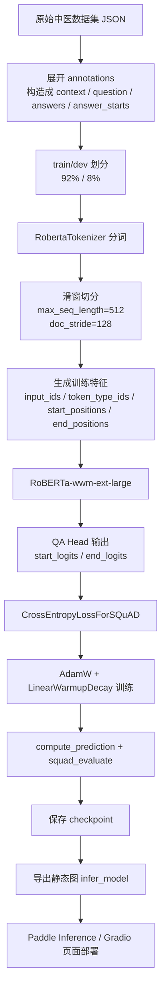
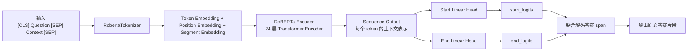
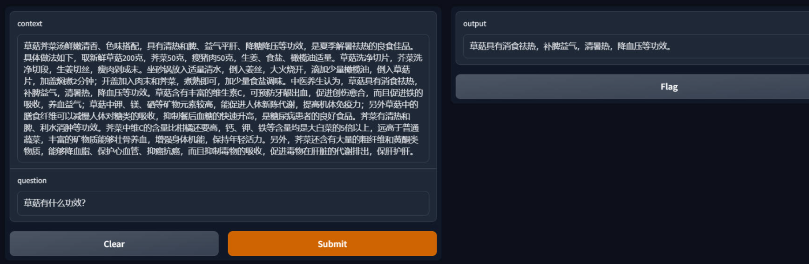
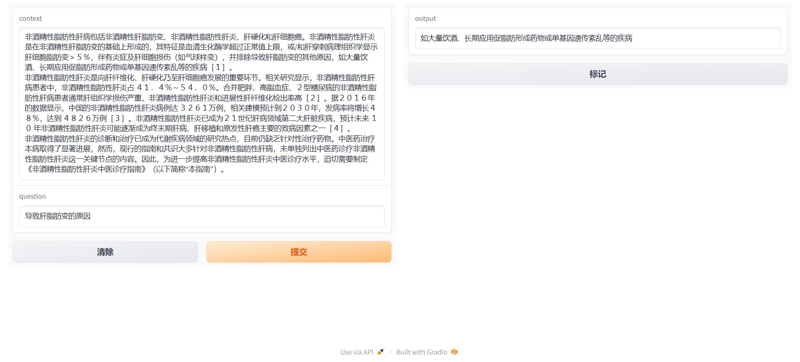

# 基于 RoBERTa 的中医药文本阅读理解项目 PPT 重构稿

> 适用场景：把现有论文、答辩 PPT、源码三部分信息统一成一份新的 PPT 文案底稿。
>
> 统一结论先说清楚：从源码 `TCM_rc.py` 来看，最终模型是 `RoBERTa-wwm-ext-large + Question Answering Head` 的标准微调方案，没有发现额外自定义改良结构；因此 PPT 里不建议写成“改良版 RoBERTa”，更稳妥的表述是“基于 RoBERTa-wwm-ext-large 的中医药抽取式阅读理解模型”。

## 1. 项目整体介绍

### 1.1 项目定位

本项目面向中医药文本问答场景，属于典型的抽取式机器阅读理解任务。系统输入一段中医文献或中医科普文本作为 `context`，再输入用户问题 `question`，模型从原文中抽取最可能的答案片段并返回。

### 1.2 项目价值

- 解决中医文献文本长、阅读成本高、查找答案慢的问题。
- 将通用阅读理解方法迁移到中医药领域，提升特定垂直场景的信息获取效率。
- 项目完整覆盖了数据处理、模型训练、效果评估、模型导出和 Web 部署，具备较完整的工程链路。

### 1.3 一句话版本

这是一个基于 PaddleNLP 和 `RoBERTa-wwm-ext-large` 的中医药抽取式问答系统，能够从给定中医文本中自动定位问题答案，并通过 Gradio 提供交互式演示页面。

### 1.4 技术栈

| 模块 | 方案 |
| --- | --- |
| 深度学习框架 | PaddlePaddle |
| NLP 工具库 | PaddleNLP |
| 数据切分 | scikit-learn |
| 预训练模型 | `roberta-wwm-ext-large` |
| 下游任务 | Question Answering / Span Extraction |
| Web 演示 | Gradio |
| 部署补充 | `paddle.jit` 动转静、`paddle.inference` |

## 2. 项目整体流程图



## 3. 最终选用模型与架构图

### 3.1 最终模型结论

- 最终选用模型：`RoBERTa-wwm-ext-large`
- 任务类型：抽取式阅读理解
- 下游头部：PaddleNLP 内置 `RobertaForQuestionAnswering`
- 是否做了结构改良：从现有源码看，没有新增 BiLSTM、CRF、多层 MLP、注意力增强模块或对抗训练模块，因此应视为标准 QA Head 微调，而不是自定义改良模型

### 3.2 选型理由

- 先后对比过 `ernie-2.0-large-en`、`bert-base-chinese`、`bert-wwm-ext-chinese`、`RoBERTa-wwm-ext-large`
- 报告中的 F1 对比结果表明，`RoBERTa-wwm-ext-large` 整体效果最好
- RoBERTa 相比 BERT 的典型优势包括：更长训练、更大 batch、去掉 NSP、优化 Mask 策略

### 3.3 模型架构图



### 3.4 模型关键配置

| 配置项 | 值 |
| --- | --- |
| `num_hidden_layers` | 24 |
| `hidden_size` | 1024 |
| `num_attention_heads` | 16 |
| `intermediate_size` | 4096 |
| `max_position_embeddings` | 512 |
| `vocab_size` | 21128 |
| `type_vocab_size` | 2 |
| `hidden_act` | gelu |
| `dropout` | 0.1 |

## 4. 数据处理

### 4.1 数据集概况

源码中的数据文件为 `中医数据集.json`，每条原始数据包含：

- `id`
- `text`
- `annotations`
- 每个 `annotation` 内部包含一组 `Q` / `A`

### 4.2 数据规模统计

| 指标 | 数值 |
| --- | --- |
| 原始文档数 | 5881 |
| 问答对总数 | 18478 |
| 平均每篇文档问答数 | 3.14 |
| 平均文本长度 | 352.40 字符 |
| 文本长度中位数 | 370 |
| 最大文本长度 | 511 |
| 平均问题长度 | 14.40 字符 |
| 平均答案长度 | 47.66 字符 |
| 训练集问答对数 | 16999 |
| 验证集问答对数 | 1479 |
| `answer_not_found` 数量 | 20 |

> 可以顺带说明：数据质量整体可用，但存在少量答案对齐失败样本，后续可以通过清洗标注和重新对齐来进一步提升效果。

### 4.3 原始 JSON 样例

```json
{
  "id": 1240,
  "text": "\"胆石症的治疗应区别不同情况分别处理，无症状胆囊结石可不作治疗，但应定期观察并注意良好的饮食习惯。有症状的胆囊结石仍以胆囊切除术为较安全有效的疗法，此外，尚可采用体外震波碎石。胆管结石宜采用以手术为主的综合治疗。胆石症的家庭治疗可采用以下方法：...",
  "annotations": [
    {
      "Q": "胆石症的治疗应注意什么？",
      "A": "应区别不同情况分别处理"
    }
  ]
}
```

### 4.4 转换后的 SQuAD 风格样例

```json
{
  "id": "1240",
  "title": "",
  "context": "\"胆石症的治疗应区别不同情况分别处理，无症状胆囊结石可不作治疗，但应定期观察并注意良好的饮食习惯。有症状的胆囊结石仍以胆囊切除术为较安全有效的疗法，此外，尚可采用体外震波碎石。胆管结石宜采用以手术为主的综合治疗。胆石症的家庭治疗可采用以下方法：...",
  "question": "胆石症的治疗应注意什么？",
  "answers": [
    "应区别不同情况分别处理"
  ],
  "answer_starts": [
    7
  ]
}
```

### 4.5 数据处理流程

1. 读取原始 JSON 文件。
2. 遍历每篇文本中的 `annotations`，将一篇文章拆成多个问答样本。
3. 使用 `text.find(answer)` 生成答案起始位置 `answer_starts`。
4. 划分训练集与验证集，比例为 `92% / 8%`。
5. 使用 `RobertaTokenizer` 编码问题与文本。
6. 对长文本采用滑窗切分：
   - `max_seq_length = 512`
   - `doc_stride = 128`
7. 生成模型训练所需字段：
   - `input_ids`
   - `token_type_ids`
   - `start_positions`
   - `end_positions`

### 4.6 数据处理可讲亮点

- 采用滑窗机制解决长文本超长问题，避免直接截断造成答案丢失。
- 将原始问答对转换为标准抽取式 QA 格式，便于复用 PaddleNLP 现成工具链。
- 在训练阶段和验证阶段分别使用不同的特征构造函数，保证训练标签和评估逻辑一致。

## 5. 模型训练

### 5.1 源码中的实际训练参数

> 这一张表建议你在 PPT 中写成“源码最终实现参数”，因为它和报告中的参考参数存在不一致。

| 参数 | 源码实际值 | 说明 |
| --- | --- | --- |
| 预训练模型 | `roberta-wwm-ext-large` | 最终模型 |
| `max_seq_length` | 512 | 长文本滑窗长度 |
| `doc_stride` | 128 | 滑窗重叠长度 |
| `batch_size` | 8 | 代码中实际使用，注释里保留过 `32` |
| `epochs` | 2 | 代码实际值 |
| `learning_rate` | `3e-5` | 最大学习率 |
| `warmup_proportion` | 0.1 | 线性预热比例 |
| `weight_decay` | 0.01 | AdamW 权重衰减 |
| 优化器 | AdamW | 带权重衰减 |
| 学习率策略 | `LinearDecayWithWarmup` | 先 warmup 再线性衰减 |
| 设备 | `gpu:0` | 代码中显式设置 GPU |

### 5.2 报告中的参考参数

报告中写到“阅读理解类问题 BERT 和 RoBERTa 模型最优参数均为 `epoch=2, batch=32, learning rate=3e-5, warmup=0.1`”，这更像是参考文献/经验参数，不完全等同于当前项目代码最终落地值。

### 5.3 推荐答辩口径

- 如果你按“最终实现”来讲：以源码为准，`batch_size=8`
- 如果你按“参考最佳经验参数”来讲：可补充报告里给出的 `batch=32`
- 但不要把二者混写成同一张表里的“最终参数”

### 5.4 损失函数

项目把答案起点和终点分别看成两个分类任务，分别计算交叉熵后取平均：

$$
L_{start} = -\frac{1}{N} \sum_{i=1}^{N} \log \frac{e^{z^s_{i,y_i^s}}}{\sum_j e^{z^s_{i,j}}}
$$

$$
L_{end} = -\frac{1}{N} \sum_{i=1}^{N} \log \frac{e^{z^e_{i,y_i^e}}}{\sum_j e^{z^e_{i,j}}}
$$

$$
L = \frac{L_{start} + L_{end}}{2}
$$

解释可以写成：

- `start_logits` 用于预测答案起始位置
- `end_logits` 用于预测答案结束位置
- 总损失是二者平均值，保证模型同时学习“从哪里开始”和“到哪里结束”

### 5.5 优化器与学习率调度

项目使用 AdamW 优化器，配合 warmup 和线性衰减学习率调度。

AdamW 更新公式可写成：

$$
m_t = \beta_1 m_{t-1} + (1 - \beta_1) g_t
$$

$$
v_t = \beta_2 v_{t-1} + (1 - \beta_2) g_t^2
$$

$$
\hat{m}_t = \frac{m_t}{1 - \beta_1^t}, \quad
\hat{v}_t = \frac{v_t}{1 - \beta_2^t}
$$

$$
\theta_{t+1} = \theta_t - \eta_t \left(\frac{\hat{m}_t}{\sqrt{\hat{v}_t} + \epsilon} + \lambda \theta_t \right)
$$

其中：

- $g_t$ 是当前梯度
- $\eta_t$ 是当前学习率
- $\lambda$ 是权重衰减系数

Warmup + 线性衰减可以写成：

$$
\eta_t =
\begin{cases}
\eta_0 \cdot \frac{t}{T_w}, & t < T_w \\
\eta_0 \cdot \left(1 - \frac{t - T_w}{T - T_w}\right), & t \ge T_w
\end{cases}
$$

这部分可以解释为：前期先小步预热，避免大模型刚开始训练时不稳定；后期再逐步下降学习率，提高收敛稳定性。

### 5.6 对抗训练说明

> 从当前源码中没有发现 FGM、PGD、AWP 等对抗训练实现，因此 PPT 中不要写成“已使用对抗训练”。

如果你想把“对抗训练”放进“后续优化方向”，可以补充 FGM 的公式：

$$
r_{adv} = \epsilon \cdot \frac{g}{\|g\|_2}
$$

$$
L_{adv} = L(x + r_{adv}, y)
$$

解释为：在词向量或输入表示上加入沿梯度方向的小扰动，提升模型鲁棒性。但这一项属于可扩展优化，不属于当前项目已实现内容。

## 6. 实验对比与结果分析

### 6.1 项目内模型选型对比

> 这部分更接近“模型选型对比”，不算严格意义上的消融实验，但完全可以放进 PPT 的“实验结果”章节。

| 模型 | 实验1 F1 | 实验2 F1 | 实验3 F1 | 平均 F1 |
| --- | ---: | ---: | ---: | ---: |
| `ernie-2.0-large-en` | 34.64 | 35.68 | 34.98 | 35.10 |
| `bert-base-chinese` | 56.62 | 57.84 | 57.12 | 57.19 |
| `bert-wwm-ext-chinese` | 59.04 | 59.94 | 59.67 | 59.55 |
| `RoBERTa-wwm-ext-large` | 62.56 | 63.29 | 62.97 | 62.94 |

### 6.2 结果解读

- `ernie-2.0-large-en` 效果最差，说明英文预训练模型不适合直接处理中文中医文本任务。
- `bert-base-chinese` 已具备基础可用性。
- `bert-wwm-ext-chinese` 进一步提升，说明中文全词 Mask 策略更适合中文问答任务。
- `RoBERTa-wwm-ext-large` 平均 F1 最高，是最终选型。

### 6.3 提升幅度

| 对比项 | 平均 F1 提升 |
| --- | ---: |
| `bert-base-chinese` 相比 `ernie-2.0-large-en` | +22.09 |
| `bert-wwm-ext-chinese` 相比 `bert-base-chinese` | +2.36 |
| `RoBERTa-wwm-ext-large` 相比 `bert-base-chinese` | +5.75 |
| `RoBERTa-wwm-ext-large` 相比 `ernie-2.0-large-en` | +27.84 |

### 6.4 文献/报告中的背景对比结果

报告还引用了各模型在 CMRC2018 数据集上的表现，可作为选型背景：

| 模型 | 开发集 EM/F1 | 测试集 EM/F1 | 挑战集 EM/F1 |
| --- | --- | --- | --- |
| BERT | 65.5 / 84.5 | 70.0 / 87.0 | 18.6 / 43.3 |
| ERNIE | 65.4 / 84.7 | 69.4 / 86.6 | 19.6 / 44.3 |
| BERT-wwm | 65.4 / 84.7 | 69.4 / 86.6 | 19.6 / 44.3 |
| BERT-wwm-ext | 65.4 / 84.7 | 69.4 / 86.6 | 19.6 / 44.3 |
| RoBERTa-wwm-ext | 65.4 / 84.7 | 69.4 / 86.6 | 19.6 / 44.3 |
| RoBERTa-wwm-ext-large | 68.5 / 88.4 | 74.2 / 90.6 | 31.5 / 60.1 |

### 6.5 结果页可以怎么讲

可以直接总结为：

1. 中文预训练模型明显优于英文模型。
2. WWM 对中文阅读理解有效。
3. `RoBERTa-wwm-ext-large` 在效果和稳定性上都优于其他候选模型，因此成为最终方案。

## 7. 评估、预测与部署

### 7.1 评估方式

源码调用：

- `compute_prediction`
- `squad_evaluate`

因此这一项目更适合写成：

- 评估指标：EM / F1
- 任务范式：SQuAD 风格抽取式 QA

> 注意：报告里有“Rouge-L 和 exact”的表述，但和当前代码不完全一致。为了保证答辩口径统一，建议直接写成“EM / F1”。

### 7.2 推理与部署流程

1. 训练完成后保存 `checkpoint`
2. 加载训练好的 tokenizer 与模型
3. 使用 `paddle.jit.to_static()` 导出静态图模型
4. 保存到 `infer_model/model`
5. 通过 `paddle.inference` 构建预测器
6. 用 Gradio 封装成网页交互页面

### 7.3 工程亮点

- 不只是“训练一个模型”，还完成了部署闭环
- 做了动转静和推理引擎调用
- 最终可以通过网页界面直接交互演示

## 8. 前端界面展示

### 8.1 页面结构

前端采用 Gradio，页面结构比较简单清晰：

- 左侧输入：`context`
- 下方输入：`question`
- 右侧输出：`output`
- 操作按钮：`Submit`、`Clear`
- 额外控件：`Flag/标记`

### 8.2 界面截图

#### 深色版本演示



#### 浅色版本演示 1


#### 浅色版本演示 2



### 8.3 界面部分可以这样讲

- 用户先输入一段中医文本作为背景知识。
- 再输入一个问题。
- 点击提交后，模型返回原文中的答案片段。
- 这种交互形式对答辩很友好，能够直观展示模型效果。

## 9. 你做新 PPT 时别漏掉的步骤

如果你要重做一套完整 PPT，建议按下面的顺序排：

1. 项目背景与应用价值
2. 项目整体流程图
3. 数据集来源与数据处理
4. 模型选型原因
5. 最终模型架构图
6. 训练参数与损失函数
7. 实验对比结果
8. 评估与部署流程
9. 前端界面展示
10. 项目不足与优化方向
11. 总结与分工

## 10. 项目不足与后续优化方向

这部分可以直接复用现有材料并稍作整理：

- 数据方面：继续补充高质量中医语料，修正少量答案截断或对齐失败样本。
- 数据增强：可尝试回译、同义改写、问句改写等方式提升泛化能力。
- 模型方面：可尝试模型集成、模型平均、更多中文医疗预训练模型。
- 训练方面：可进一步系统调参，如 batch size、epoch、weight decay、warmup。
- 鲁棒性方面：可增加 FGM/PGD 等对抗训练。
- 系统方面：可加入检索模块，升级为“检索增强 + 阅读理解”的完整问答系统。
- 部署方面：可进一步封装 API，结合 Flask / FastAPI / Docker 做更规范的服务化部署。

## 11. 答辩时建议统一口径

这一页不一定放进 PPT，但你自己讲的时候最好统一：

| 项目点 | 建议说法 |
| --- | --- |
| 最终模型 | `RoBERTa-wwm-ext-large + QA Head` |
| 是否改良模型 | 从现有源码看，没有自定义结构改良 |
| 实际 batch size | 代码里是 8 |
| 参考经验参数 | 报告里提到过 `batch=32` 的最佳经验值 |
| 实际评估指标 | EM / F1 |
| 是否使用对抗训练 | 当前项目未实现，不要写成已使用 |

## 12. 可以直接放到结尾页的总结

本项目围绕中医药文本阅读理解任务，完成了从数据处理、模型微调、效果评估到 Web 部署的完整流程。最终选用 `RoBERTa-wwm-ext-large` 作为核心模型，在多组候选模型对比中取得了最优 F1 表现，验证了中文预训练模型和全词 Mask 策略在中医问答场景中的有效性。项目最终以 Gradio 页面形式完成交互式展示，具备较好的可演示性与工程完整度。
