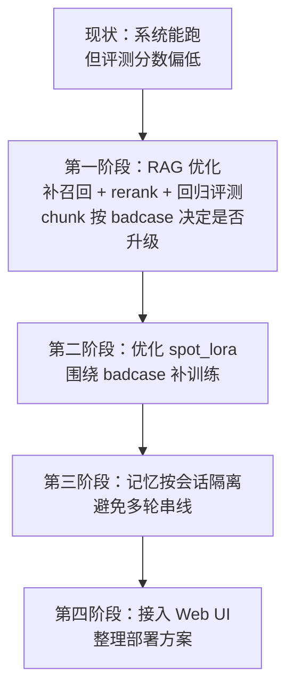
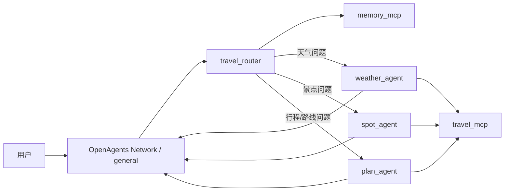

# 项目不足与优化路线图

## 项目当前主要不足

### 1. 文档与真实运行架构存在漂移

- 设计文档和 README 中仍残留部分“关键词触发 / 广播式协作”的旧表述。
- 实际运行机制已经是 `travel_router -> direct message -> 专业 Agent -> MCP 工具` 的串行路由。
- 这会影响项目答辩、交接说明和后续维护的一致性。

### 2. 协议稳定性不足

- `weather_agent`、`spot_agent`、`plan_agent` 都依赖 fallback runner 补发消息。
- 说明模型还不能稳定遵守“必须通过消息工具回复”的协议。
- 当前能跑通，但稳定性更像“补丁式兜底”，不是强约束工作流。

### 3. 工具层边界不够清晰

- `mcp_server.py` 同时承担“工具暴露”和“部分业务实现”的职责。
- `memory_mcp.py` 与 `mcp_server.py` 对记忆能力存在重叠暴露。
- `search_spots`、`get_driving_route` 在 MCP 层与 `tools/` 层有重复实现，后期容易逻辑分叉。

### 4. 记忆系统仍是单机原型

- 当前记忆直接落盘到 `storage/user_context.json`。
- 缺少用户隔离、会话隔离、并发控制、过期清理和冲突处理。
- 一旦进入多用户或并行会话场景，容易出现上下文串线。

### 5. RAG 能跑，但精确检索能力偏弱

- 当前是 `FAISS + BM25-like + handwritten bonus` 的混合检索。
- 词法部分不是标准 BM25，也没有二阶段 rerank。
- 现有评测中，严格 `Hit@1 = 35.9%`，精确景点类仅 `23.8%`，说明泛问法较好，但精确实体问答仍弱。

### 6. UI 与部署仍偏实验性质

- `web_ui.py` 目前还是模拟回复，不是真正连通 OpenAgents 后端。
- `start_all.bat` / `stop_all.bat` 对本机路径和 Windows 环境依赖较强。
- 跨平台部署、容器化、配置中心和生产可运维性都还不够。

### 7. 自动化测试与回归保障不足

- 仓库中缺少清晰的业务测试目录。
- 当前更偏手工验证和实验报告沉淀。
- 还缺路由正确率、工具调用成功率、RAG 回归集、端到端对话回放等稳定性防线。

## 优化优先级建议

### 第一阶段：优先解决 RAG 评测效果低

1. 先补召回能力，提升精确景点和城市+景点问题的命中率。
2. 增加 rerank，避免召回到了但排不到前面。
3. 建立稳定的回归评测集，每次改检索策略都跑统一指标。
4. `chunk` 是否升级，不建议先拍脑袋改。
5. 只有当 badcase 分析证明“信息被切碎”或“一个 chunk 装太多景点”时，再做 chunk 粒度优化。

### 第二阶段：优化 `spot_lora`

1. 重点看工具调用格式、景点回答质量和遵守路由边界的分数。
2. 结合 badcase 补训练数据，而不是只继续堆样本数量。
3. 让 `spot_lora` 优化目标和当前真实流程一致：POI、RAG、组合回答、消息工具回复。

### 第三阶段：升级记忆系统

1. 先做按会话隔离。
2. 后续再补用户维度、线程维度和过期清理。
3. 避免不同对话之间共享同一个 `user_context.json`。

### 第四阶段：接入 Web UI 与部署方案

1. 把当前演示型 UI 改成真实连接 OpenAgents 后端。
2. 再处理启动脚本、配置化、部署方式和对外演示。

## 优化路线图

## 当前真实业务流程图

