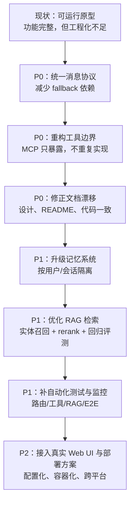
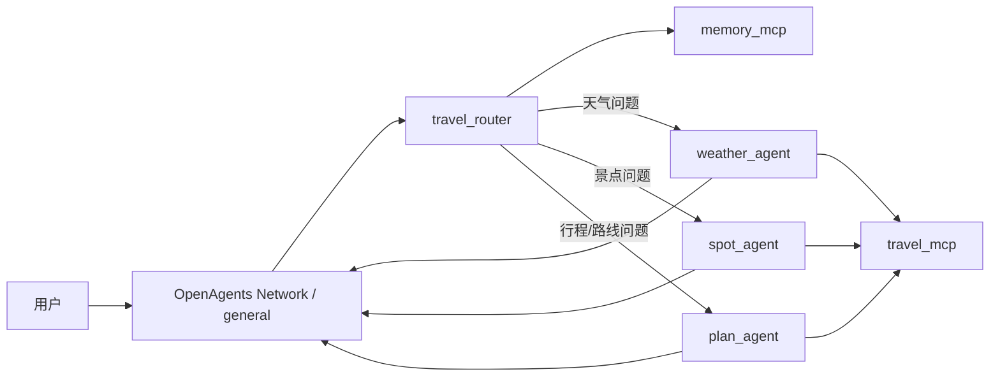

# 项目不足与优化路线图

## 项目当前主要不足

### 1. 文档与真实运行架构存在漂移

- 设计文档和 README 中仍残留部分“关键词触发 / 广播式协作”的旧表述。
- 实际运行机制已经是 `travel_router -> direct message -> 专业 Agent -> MCP 工具` 的串行路由。
- 这会影响项目答辩、交接说明和后续维护的一致性。

### 2. 协议稳定性不足

- `weather_agent`、`spot_agent`、`plan_agent` 都依赖 fallback runner 补发消息。
- 说明模型还不能稳定遵守“必须通过消息工具回复”的协议。
- 当前能跑通，但稳定性更像“补丁式兜底”，不是强约束工作流。

### 3. 工具层边界不够清晰

- `mcp_server.py` 同时承担“工具暴露”和“部分业务实现”的职责。
- `memory_mcp.py` 与 `mcp_server.py` 对记忆能力存在重叠暴露。
- `search_spots`、`get_driving_route` 在 MCP 层与 `tools/` 层有重复实现，后期容易逻辑分叉。

### 4. 记忆系统仍是单机原型

- 当前记忆直接落盘到 `storage/user_context.json`。
- 缺少用户隔离、会话隔离、并发控制、过期清理和冲突处理。
- 一旦进入多用户或并行会话场景，容易出现上下文串线。

### 5. RAG 能跑，但精确检索能力偏弱

- 当前是 `FAISS + BM25-like + handwritten bonus` 的混合检索。
- 词法部分不是标准 BM25，也没有二阶段 rerank。
- 现有评测中，严格 `Hit@1 = 35.9%`，精确景点类仅 `23.8%`，说明泛问法较好，但精确实体问答仍弱。

### 6. UI 与部署仍偏实验性质

- `web_ui.py` 目前还是模拟回复，不是真正连通 OpenAgents 后端。
- `start_all.bat` / `stop_all.bat` 对本机路径和 Windows 环境依赖较强。
- 跨平台部署、容器化、配置中心和生产可运维性都还不够。

### 7. 自动化测试与回归保障不足

- 仓库中缺少清晰的业务测试目录。
- 当前更偏手工验证和实验报告沉淀。
- 还缺路由正确率、工具调用成功率、RAG 回归集、端到端对话回放等稳定性防线。

## 优化优先级建议

### P0：先解决“系统稳不稳”

1. 收口消息回复协议，减少 fallback 依赖。
2. 统一工具边界，让 MCP 只负责暴露能力，不重复写业务逻辑。
3. 修正文档漂移，让 README、设计文档和真实运行时对齐。

### P1：再解决“系统准不准”

1. 升级记忆系统，加入用户、线程、会话维度。
2. 优化 RAG，补实体召回、标准词法检索、二阶段 rerank。
3. 建立自动化评测和回归测试机制。

### P2：最后解决“系统好不好用”

1. 把 Web UI 改成真实联通后端的可用前端。
2. 做配置化、容器化和跨平台启动。
3. 增加监控、日志聚合和错误诊断能力。

## 优化路线图

## 当前真实业务流程图

